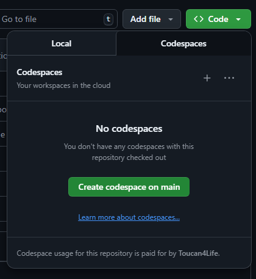
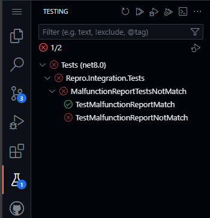

# ReproBug

## Step to reproduce :

1) Launch codespace in main :

2) Wait for tests to show up in IDE (this can take some time):

3) - Run tests one by one => it works
   - Run all tests simultaneously => it fails

## Actual :
Can't launch simultaneously tests that works individually

## Expected
Launching tests simultaneously should work
